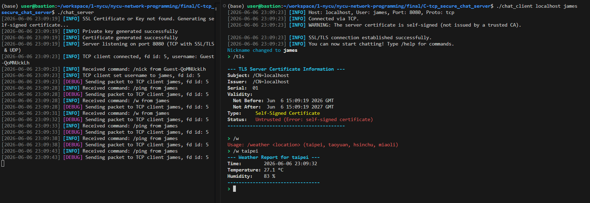

# Final Exam

## design decisions (midterm)

1. Modular Architecture:
    - `ChatServer` class (in `server.h`) encapsulates all server-side logic, including client management and message handling.
    - `BaseClient` (in `client.h`) with `TCPClient` and `UDPClient` subclasses provides a polymorphic interface basic operations.
    - Centralized logging (`logging.h`) and color tokens (`colors.h`) are used throughout the project.
2. heartbeat & lazy deletion:
    - client pings every 3 seconds and server responds with `[PONG]`, server updates last_seen time
    - on client side, if server doesn't respond to ping with `[PONG]` for 3 times, it will stop and exit
    - on server side, if last_seen time of a client is more than 10 seconds ago, it will be set to inactive for lazy deletion
    - for all disconnection events (including timeout, client quit, etc.), the client will be set to inactive instead of removed immediately
    - in the while loop, before select, iterate all clients and check for is_active, if inactive, remove it from all_clients
3. file descriptor management:
    - since select will modify the `fd_set`, we rebuild a `working_fds` bitmask every loop before select
    - in each rebuild, add `tcp_listen` socket (usually 3), `udp_socket` (usually 4), and all active clients' file descriptors to `working_fds` and update `max_fd`
4. tcp/udp connection handling:
    - for tcp, new connection is handled when `tcp_listen` fd is set, and new message is handled when specific client fd is set
    - for udp, new connection and message are both handled when `udp_socket` fd is set, and we determine if it's a new connection by checking if the source ip and port are already in `all_clients`
5. client name initialization:
    - for both tcp and udp, when a new client connects, assign a random username to it (Guest-{random_string})
    - since `your_name` is a required argment in the assignment, so i just send a `/nick` command to change the username to the one you provided when connected to the server
6. udp application layer two-way handshake:
    - when a client wants to connect via udp, it will send a `/ping` command to the server
    - the server will respond with a `[PONG]` message to the client
    - if the client doesn't receive a `[PONG]` message within 3 seconds, it will assume the connection is failed

## design decisions (final)

1. midterm design decisions are kept since required argument are not changed.
2. use an additional ssl_helper.h file declare inline helper function for SSL/TLS and keep the chat_server.cpp and chat_client.cpp clean as possible.
3. SSL/TLS is used by default for tcp connections.
4. ignore sigpipe signal to avoid server get killed when certificate verification fails on client side
5. use a WeatherData struct pointer to store weather information and let get_weather function return 0 if success and -1 if failed

## additional features (midterm)

1. Join/Leave Notifications: Server broadcasts system-wide notifications when clients connect or disconnect.
2. Color-Coded Output: 
   - Timestamps are gray.
   - Usernames are bold white.
   - Command responses are cyan.
   - Direct messages are magenta.
   - Protocol indicators are green (TCP) and yellow (UDP).
3. Enhanced Logging: Server console features timestamped logs with colored levels (`INFO`, `DEBUG`, `ERROR`).
4. Command Suite:
   - `/help`: Detailed command list.
   - `/dm <user> <msg>`: Private messaging.
   - `/list`: List all active users.
   - `/nick <name>`: Rename user.
   - `/quit`: Graceful disconnect.
   - `/ping`: Manual heartbeat update.
5. message delivery confirmation:
    - when a client sends a message, the server will respond with `[SENT]` to indicate that the message has been received
    - on client side, before receiving `[SENT]`, it will add a `(message sending...)` postfix to the message, and after receiving `[SENT]`, it will replace `(message sending...)` with `(message sent)`

## additional features (final)

1. if `server.crt` or `server.key` doesn't exist, server will generate key and a self-signed certificate automatically
2. connection will fail if server's certificate is expired or the certificate's common name doesn't match the hostname
3. warn user if the certificate is self-signed (not issued by a trusted CA)
4. add `/tls` command to obtain the server certificate information
5. add `/weather <location>` command to obtain weather information using the api provided in the assignment A

## observations (midterm)

- when server reboots, all tcp client will be disconnected, but for udp clients, they will be reconnected and add to all_clients again due to the `/ping` command if its not exited yet, and it will get a new Guest-xxxxx username, although we can send `/nick` command to change the username to the one we provided when connected to the server, but i think its fine to leave it as it is to show what will happen when username isn't provided

## observations (final)

- when certificate verification fails (ex: certificate common name doesn't match hostname), the server will might get killed because it will try to send SSL close_notify alert message to client, but the client's ssl connection has been closed already at the moment when verification fails, hence sending alert message will cause SIGPIPE signal (sending message to a closed socket), so i ignore SIGPIPE signal on server side to avoid this kind of crash

## tmux test script

```bash
bash test.sh
```

## demo

